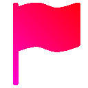

<!-- Improved compatibility of back to top link: See: https://github.com/othneildrew/Best-README-Template/pull/73 -->

<!--
*** Thanks for checking out the Best-README-Template. If you have a suggestion
*** that would make this better, please fork the repo and create a pull request
*** or simply open an issue with the tag "enhancement".
*** Don't forget to give the project a star!
*** Thanks again! Now go create something AMAZING! :D
-->

<!-- PROJECT SHIELDS -->
<!--
*** I'm using markdown "reference style" links for readability.
*** Reference links are enclosed in brackets [ ] instead of parentheses ( ).
*** See the bottom of this document for the declaration of the reference variables
*** for contributors-url, forks-url, etc. This is an optional, concise syntax you may use.
*** https://www.markdownguide.org/basic-syntax/#reference-style-links
-->
[![Open issues][openissues-badge]][openissues-url]
[![Contributors][contributors-badge]][contributors-url]
[![OQL License][license-badge]][license-url]

<!-- PROJECT LOGO -->
 

  

<h3 align="center">queer.valbuilds.gay</h3>

  

    A website for all things gay!
     
    <a href="https://github.com/valbuilds/queer.valbuilds.gay"><strong>Explore the docs »</strong></a>
     
     
    <a href="https://github.com/valbuilds/queer.valbuilds.gay">View Demo</a>
    ·
    <a href="https://github.com/valbuilds/queer.valbuilds.gay/issues">Report Bug</a>
    ·
    <a href="https://github.com/valbuilds/queer.valbuilds.gay/issues">Request Feature</a>
  

<!-- TABLE OF CONTENTS -->

  
Table of Contents

  <ol>
    <li>
      <a href="#about-the-project">About The Project</a>
      <ul>
        <li><a href="#built-with">Built With</a></li>
      </ul>
    </li>
    <li>
      <a href="#getting-started">Getting Started</a>
      <ul>
        <li><a href="#prerequisites">Prerequisites</a></li>
        <li><a href="#installation">Installation</a></li>
      </ul>
    </li>
    <li><a href="#usage">Usage</a></li>
    <li><a href="#roadmap">Roadmap</a></li>
    <li><a href="#contributing">Contributing</a></li>
    <li><a href="#license">License</a></li>
    <li><a href="#contact">Contact</a></li>
    <li><a href="#acknowledgments">Acknowledgments</a></li>
  </ol>

<!-- ABOUT THE PROJECT -->
## About The Project

> This is a wacko project of mine, inspired by multiple wikis and pronouns.page.

*ValBuilds*

On the website you'll start at Cataleya's Café, a warm and welcoming space for you to sit down and maybe have a cup of coffee! *(or really any drink)*

The top navbar has all the different spaces you can visit. Those being
- Gaia's Genders
- Sean's Sexual Orientations
- Remy's Romantic Orientations
- Reid's Relationship Models
- Hendrix's Home

All 5 of the spaces have different characters.

_[Read more about the characters »](https://queer.valbuilds.xyz/extra/characters)_

(<a href="#readme-top">back to top</a>)

### Tools Used

#### IDE
[![Visual Studio Code][vsc-badge]][vsc-url]

#### Languages
<!-- These are combined for nice aesthetics. -->
[![HTML5][html5-badge]][html5-url]
[![CSS3][css3-badge]][css3-url]
[![JavaScript][js-badge]][js-url]

### Extra
[![Boostrap][bs-badge]][bs-url]

#### Hosted with
[![Github Pages][ghpg-badge]][ghpg-url]

(<a href="#readme-top">back to top</a>)

<!-- ROADMAP -->
## Roadmap

- [ ] Cataleya's Café (main area)
    - [ ] About the site
    - [ ] Resources for coming out
    - [ ] Resources for transitions
- [ ] Gaia's Genders
- [ ] Sean's Sexual Orientations
- [ ] Remy's Romantic Orientations
- [ ] Reid's Relationship Models
- [ ] Hendrix's Home
- [ ] Easy to view lists
    - [ ] Genders
    - [ ] Sexual Orientations
        - [ ] Romantic Orientations
    - [ ] Relationship Models
- [ ] JSON Data
    - [ ] Lists
        - [ ] Genders
        - [ ] Sexual Orientations
            - [ ] Romantic Orientations
        - [ ] Relationship Models

_See the [open issues](https://github.com/valbuilds/queer.valbuilds.gay/issues) for a full list of proposed features (and known issues)._

_You can also view the project page to go more in-depth._

(<a href="#readme-top">back to top</a>)

<!-- CONTRIBUTING -->
## Contributing

Contributions are what make the open source community such an amazing place to learn, inspire, and create. *Any contributions you make are **greatly appreciated**.*

If you have a suggestion that would make this better, please fork the repo and create a pull request. You can also simply open an issue with the tag "enhancement".
Don't forget to give the project a star! Thanks again!

1. [Fork the Project](https://github.com/valbuilds/queer.valbuilds.gay/fork)
2. Create your Feature Branch (`git checkout -b feature/AmazingFeature`)
3. Commit your Changes (`git commit -m 'Add some AmazingFeature'`)
4. Push to the Branch (`git push origin feature/AmazingFeature`)
5. [Open a Pull Request](https://github.com/valbuilds/queer.valbuilds.gay/pulls)

(<a href="#readme-top">back to top</a>)

<!-- LICENSE -->
## License

Distributed under the OQL License. See [`LICENSE.txt`][license-url] for more information.

(<a href="#readme-top">back to top</a>)

<!-- CONTACT -->
## Contact

ValBuilds - [@valonthenet](https://twitter.com/valonthenet) - contact@valbuilds.xyz - .gg/

Project Link: [https://github.com/valbuilds/queer.valbuilds.gay](https://github.com/valbuilds/queer.valbuilds.gay)

(<a href="#readme-top">back to top</a>)

<!-- ACKNOWLEDGMENTS -->
## Acknowledgments

* [pronouns.page]() - for inspiration and data
* [Gender Wiki on Fandom]() - for intpiration and data
* [Sexuality and Orientations Wiki on Fandom]() - for intpiration and data
* [LGBTQIA+ Wiki on Fandom]() - for intpiration and data

(<a href="#readme-top">back to top</a>)

<!-- MARKDOWN LINKS & IMAGES -->
<!-- https://www.markdownguide.org/basic-syntax/#reference-style-links -->
[openissues-badge]: https://badgers.space/github/open-issues/valbuilds/queer.valbuilds.gay
[openissues-url]: https://github.com/valbuilds/queer.valbuilds.gay/issues

[contributors-badge]: https://badgers.space/github/contributors/valbuilds/queer.valbuilds.gay
[contributors-url]: https://github.com/valbuilds/queer.valbuilds.gay/graphs/contributors

[license-badge]: https://badgers.space/badge/License/OQL/pink
[license-url]: https://github.com/valbuilds/queer.valbuilds.gay/blob/master/LICENSE.md

[vsc-badge]: https://badgers.space/badge/IDE/VSC/007ACC?label=&label_color=black&icon=https://github.com/valbuilds/queer.valbuilds.gay/blob/main/readme-assets/icons/vsc.png?raw=true
[vsc-url]: https://code.visualstudio.com

[html5-badge]: https://badgers.space/badge/Language/HTML5/E34F26?label=&label_color=black&icon=https://github.com/valbuilds/queer.valbuilds.gay/blob/main/readme-assets/icons/html5.png?raw=true
[html5-url]: https://www.w3schools.com/html/default.asp

[css3-badge]: https://badgers.space/badge/Language/CSS3/1572B6?label=&label_color=black&icon=https://github.com/valbuilds/queer.valbuilds.gay/blob/main/readme-assets/icons/css3.png?raw=true
[css3-url]: https://www.w3schools.com/css/default.asp

[js-badge]: https://badgers.space/badge/Language/JavaScript/black?label=&label_color=F7DF1E&icon=https://github.com/valbuilds/queer.valbuilds.gay/blob/main/readme-assets/icons/js.png?raw=true
[js-url]: https://www.w3schools.com/js/default.asp

[bs-badge]: https://badgers.space/badge/Extra/Bootstrap/7952B3?label=&label_color=black&icon=https://github.com/valbuilds/queer.valbuilds.gay/blob/main/readme-assets/icons/bs.png?raw=true
[bs-url]: https://getbootstrap.com

[ghpg-badge]: https://badgers.space/badge/IDE/GitHub Pages/222222?label=&label_color=black&icon=https://github.com/valbuilds/queer.valbuilds.gay/blob/main/readme-assets/icons/gh.png?raw=true
[ghpg-url]: pages.github.com